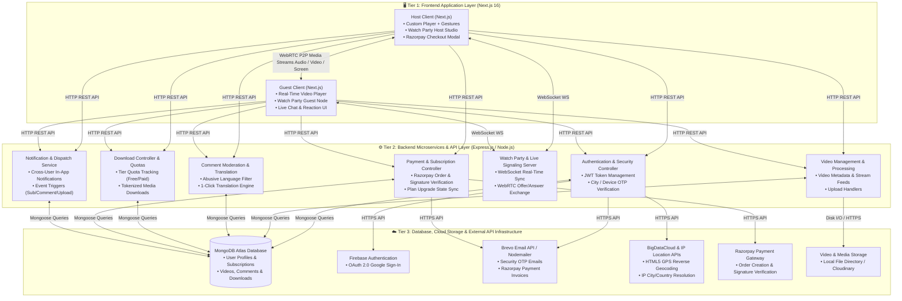

# 🎥 My YouTube — Full-Stack Video Streaming & Interactive Community Platform

> A feature-rich, high-performance YouTube clone built with Next.js, Node.js, Express, MongoDB, WebSockets, and WebRTC. Features real-time Watch Parties, tier-based controlled video downloads, Razorpay membership subscriptions, double-tap gesture custom video player, automated comment moderation with 1-click translation, and dynamic time/region security OTP verification.


---

🔗 **Live Production App:** [https://psmk-youtube.vercel.app](https://psmk-youtube.vercel.app)  

---

## 📌 Table of Contents

- [✨ Features](#-features)
- [🛠️ Tech Stack & System Architecture](#️-tech-stack--system-architecture)
- [🚀 Getting Started & Local Setup](#-getting-started--local-setup)
  - [Prerequisites](#prerequisites)
  - [Installation & Setup](#installation--setup)
  - [Environment Variables Configuration](#environment-variables-configuration)
- [📡 API Documentation](#-api-documentation)
- [📂 Project Folder Structure](#-project-folder-structure)
- [🌐 Deployment Guide](#-deployment-guide)
- [⚠️ Known Limitations & Edge Cases](#️-known-limitations--edge-cases)
- [🗺️ Project Roadmap & Verified Enhancements](#️-project-roadmap--verified-enhancements)
- [🤝 Contributing](#-contributing)
- [📄 License](#-license)
- [👤 Author](#-author)

---

## ✨ Features

### 1. 👥 Real-Time Watch Party (WebRTC & WebSockets)
- **Peer-to-Peer Video & Audio Calls**: Watch videos in sync with friends while seeing and hearing them via WebRTC.
- **Room System & Invite Links**: Create or join custom room IDs with instant link sharing.
- **Screen Sharing**: Broadcast your screen to all room participants (with mobile OS restriction detection).
- **Session Chat History**: Real-time room chat persisted across session reloads.
- **Call Controls**: Mute/unmute microphone, toggle camera on/off, host room controls, and leave call functionality.
- **Per-Participant Volume Controls**: Adjust audio volume sliders for each participant individually.
- **Local Recording**: Record watch party sessions locally and save directly to your device.

### 2. 📥 Controlled Video Download System
- **Tier-Based Quotas**:
  - **Free Tier**: Restricted to **1 video download per day**.
  - **Bronze / Silver / Gold Tiers**: Higher and unlimited daily download limits.
- **Interactive Limit Modal**: Displays download progress counters (`1/1 downloads used`) with upgrade prompts.
- **Dedicated Downloads Section**: Accessible at `/downloads` in the user profile to manage all offline videos.
- **Detailed History Tracking**: Stores download timestamps, video metadata, user plan, and file references in MongoDB.

### 3. 💳 Subscription Upgrades & Razorpay Integration
- **Membership Tiers**: Free, Bronze (₹99/mo), Silver (₹199/mo), and Gold (₹499/mo).
- **Benefit Unlocks**: Ad-free viewing, longer watch times, exclusive premium videos, and higher download quotas.
- **Razorpay Payments**: Integrated Razorpay Checkout flow for test/live transactions.
- **Automated Email Invoices**: Sends transaction confirmation emails and official PDF-styled invoices with transaction IDs via Brevo / Nodemailer upon successful payment.

### 4. 🎬 Custom Video Player & Mobile Touch Gestures
- **Modern Controls**: Custom play/pause, volume slider/mute, full-screen toggle, and duration display.
- **±10 Second Seek Buttons**: Instant skip forward 10s and rewind backward 10s.
- **Double-Tap Mobile Gestures**:
  - **Double-Tap Right Half**: Skip forward 10 seconds.
  - **Double-Tap Left Half**: Rewind backward 10 seconds.
- **Autoplay & Next Video**: Automatically queues and plays the next recommended video upon completion.

### 5. 🕒 Dynamic Time/Region Theme & High-Accuracy Security OTP
- **Automatic Light/Dark Mode**:
  - **10:00 AM – 12:00 PM IST**: Automatically enables Light Theme.
  - **Other Time Ranges**: Dark Theme applied by default.
  - **User Preference Memory**: Saved in user profile with a manual theme toggle in the navigation bar.
- **Location & Device Security OTP**:
  - Uses HTML5 GPS reverse-geocoding (BigDataCloud API) + multi-provider IP fallbacks (`ipwho.is` / `ipapi.co`).
  - Detects logins from new cities, states, or devices and requires 6-digit email OTP verification before granting access.

### 6. 💬 Multilingual Comments & Community Moderation Guard
- **1-Click Comment Translation**: Translates comments into the user's preferred language instantly.
- **Privacy Location Attachment**: Optional `"📍 Attach Location"` toggle (`City, Country`) instead of exposing public location automatically.
- **Automated Moderation Guard**: Pre-scans comments to block abusive language, spam, and symbol/special-character flooding.
- **Reporting System**: Flag inappropriate comments for admin review without automatic deletion.

---

## 🛠️ Tech Stack & System Architecture

### Frontend (Client)
- **Framework**: [Next.js 16](https://nextjs.org/) (Pages Router, Turbopack)
- **UI Library**: [React 19](https://react.dev/), [TailwindCSS 3.4](https://tailwindcss.com/)
- **Icons & Components**: Lucide React, Shadcn/ui primitives (`@base-ui/react`)
- **Authentication**: Firebase Auth (Google Sign-In) & Custom JWT
- **HTTP Client**: Axios with custom interceptors
- **Real-Time Client**: Native WebSockets API & WebRTC (`RTCPeerConnection`)

### Backend (Server)
- **Runtime**: [Node.js](https://nodejs.org/) (v18+)
- **Framework**: [Express.js](https://expressjs.com/)
- **Database**: [MongoDB Atlas](https://www.mongodb.com/cloud/atlas) with [Mongoose ORM](https://mongoosejs.com/)
- **Real-Time Communication**: `ws` WebSocket Server (attached to HTTP server for live broadcasts and WebRTC signaling)
- **Payments**: Razorpay Node.js SDK
- **Email Service**: Brevo Email API / Nodemailer (SMTP OTP & Email Invoices)
- **Media Storage**: Local Disk Storage / Cloudinary Backup

---

### System Architecture Flowmap



---

## 🚀 Getting Started & Local Setup

Follow these steps to run the project locally on your machine.

### Prerequisites
- **Node.js**: `v18.0.0` or higher
- **npm** or **yarn**
- **MongoDB**: A local MongoDB instance or MongoDB Atlas Connection URI
- **Git**

---

### Installation & Setup

1. **Clone the Repository:**
   ```bash
   git clone https://github.com/Srimanikanta2006/My-YouTube.git
   cd My-YouTube
   ```

2. **Setup & Install Backend Dependencies:**
   ```bash
   cd server
   npm install
   ```

3. **Setup & Install Frontend Dependencies:**
   ```bash
   cd ../youtube
   npm install
   ```

---

### Environment Variables Configuration

> ⚠️ **Security Notice:** Never commit your actual `.env` or `.env.local` files to Git. Keep private credentials secret and ensure `.env` is listed in your `.gitignore` file.

Create a `.env` file in the `server/` directory (see [`server/.env.example`](./server/.env.example) for placeholder template):

```env
# Server Configuration
PORT=5000
NODE_ENV=development

# Database Connection
MONGO_URI=mongodb+srv://<username>:<password>@cluster0.mongodb.net/myyoutube?retryWrites=true&w=majority

# JWT Authentication Secret
JWT_SECRET=your_super_secret_jwt_key_here

# Email Configuration (Brevo API Key or Nodemailer SMTP)
BREVO_API_KEY=your_brevo_api_key_here
EMAIL_USER=your_email@gmail.com
EMAIL_PASS=your_gmail_app_password

# Razorpay Test Credentials
RAZORPAY_KEY_ID=rzp_test_YourKeyIdHere
RAZORPAY_KEY_SECRET=YourKeySecretHere

# Frontend URL (For CORS & Redirects)
CLIENT_URL=http://localhost:3000
```

Create a `.env.local` file in the `youtube/` directory (see [`youtube/.env.local.example`](./youtube/.env.local.example) for placeholder template):

```env
# Public Backend Base URL
NEXT_PUBLIC_BACKEND_URL=http://localhost:5000
NEXT_PUBLIC_RAZORPAY_KEY_ID=rzp_test_YourKeyIdHere
```

---

### Running Locally

1. **Start the Express Backend Server:**
   ```bash
   cd server
   npm start
   ```
   *Backend server will start at `http://localhost:5000` with WebSocket signaling enabled.*

2. **Start the Next.js Frontend App:**
   ```bash
   cd youtube
   npm run dev
   ```
   *Frontend app will start at `http://localhost:3000`.*

---

## 📡 API Documentation

### 🔑 Authentication & Location Security Endpoints

| Method | Endpoint | Description | Auth Required |
| :--- | :--- | :--- | :---: |
| `POST` | `/user/signup` | Register a new account | No |
| `POST` | `/user/login` | Authenticate user & check new device/city location | No |
| `POST` | `/user/verify-otp` | Verify 6-digit email OTP for new device logins | No |
| `POST` | `/user/resend-otp` | Resend security verification OTP to registered email | No |
| `PATCH` | `/user/update/:id` | Update user profile, channel details & theme preferences | Yes |

### 🎬 Video Management & Download Endpoints

| Method | Endpoint | Description | Auth Required |
| :--- | :--- | :--- | :---: |
| `GET` | `/video/getallvideo` | Retrieve all public videos with exact subscriber counts | No |
| `GET` | `/video/getvideo/:id` | Fetch detailed video metadata by ID | No |
| `POST` | `/video/upload` | Upload a new video file with thumbnail & metadata | Yes |
| `PATCH` | `/video/update/:id` | Update video title and description | Yes |
| `DELETE` | `/video/delete/:id` | Permanently delete a video | Yes |
| `POST` | `/video/download` | Process video download with tier limit checks | Yes |
| `GET` | `/video/user-downloads` | Retrieve current user's download history | Yes |

### 💬 Comments & Community Moderation Endpoints

| Method | Endpoint | Description | Auth Required |
| :--- | :--- | :--- | :---: |
| `GET` | `/comment/:videoId` | Get comments for a specific video | No |
| `POST` | `/comment/postcomment` | Post a comment (scanned by Moderation Guard) | Yes |
| `POST` | `/comment/like/:id` | Toggle like on a comment | Yes |
| `POST` | `/comment/dislike/:id` | Toggle dislike on a comment | Yes |
| `POST` | `/comment/translate` | Translate comment text into requested target language | No |
| `POST` | `/comment/report/:id` | Flag a comment for review with reason | Yes |

### 💳 Subscriptions & Razorpay Payment Endpoints

| Method | Endpoint | Description | Auth Required |
| :--- | :--- | :--- | :---: |
| `POST` | `/user/subscribe` | Subscribe/unsubscribe to a channel (Triggers WS live sync) | Yes |
| `POST` | `/payment/create-order` | Create a new Razorpay order for Bronze/Silver/Gold plan | Yes |
| `POST` | `/payment/verify` | Verify Razorpay payment signature & issue email invoice | Yes |

---

## 📂 Project Folder Structure

```
My YouTube/
├── server/                           # Express.js Backend Server
│   ├── Controllers/                  # Business Logic Controllers
│   │   ├── Auth.js                   # Authentication & Location Security OTP
│   │   ├── video.js                  # Video Fetching, Upload & Downloads
│   │   ├── Comment.js                # Moderation Guard & Translation
│   │   ├── notification.js           # Real-Time Notification Dispatcher
│   │   └── Payment.js                # Razorpay Order Creation & Email Invoices
│   ├── models/                       # MongoDB Schemas (User, Video, Comment, Download, Notification)
│   ├── routes/                       # Express Route Handlers
│   ├── utils/                        # Email Transporter & Helper Functions
│   ├── index.js                      # Express App & WebSocket Server Entry Point
│   └── package.json
│
├── youtube/                          # Next.js Frontend Application
│   ├── src/
│   │   ├── components/               # React UI Components
│   │   │   ├── Header.tsx            # Navigation Bar & Search Box
│   │   │   ├── VideoInfo.tsx         # Watch Page Details & Action Row
│   │   │   ├── Videoplayer.tsx       # Custom Video Player + Double-Tap Gestures
│   │   │   ├── Comments.tsx          # Comments Section + Translation & Moderation
│   │   │   ├── WatchPartyPanel.tsx   # WebRTC Video Call & Screen Share Panel
│   │   │   ├── ChannelHeader.tsx     # Channel Page Banner & Subscriber Counter
│   │   │   ├── DownloadsContent.tsx  # Offline Downloads Management Page
│   │   │   └── MembershipContent.tsx # Razorpay Subscriptions & Tier Upgrade
│   │   ├── lib/                      # Auth Context & Axios Helpers
│   │   │   ├── AuthContext.js        # Global User State & GPS Geocoding
│   │   │   ├── firebase.js           # Firebase Auth Config
│   │   │   ├── axiosinstance.ts      # Axios Instance with Backend Interceptor
│   │   │   └── urlHelper.ts          # URL Normalizer & WebSocket Resolver
│   │   └── pages/                    # Next.js Page Routes
│   │       ├── index.tsx             # Home Video Feed
│   │       ├── watch/[id].tsx        # Video Player Page
│   │       ├── watch-party.tsx       # WebRTC Watch Party Theater
│   │       ├── downloads.tsx         # User Downloads Profile Page
│   │       ├── membership.tsx        # Tiered Membership Plans Page
│   │       └── channel/[id]/index.tsx# Channel Details & Video Upload
│   └── package.json
│
├── LICENSE                           # Official MIT License File
└── README.md                         # Project Master Documentation
```

---

## 🌐 Deployment Guide

### Deploying Frontend to Vercel
1. Push your code to GitHub.
2. Go to [Vercel](https://vercel.com/) and click **"Add New Project"**.
3. Import the `Srimanikanta2006/My-YouTube` repository.
4. Set **Root Directory** to `youtube`.
5. Add Environment Variables (`NEXT_PUBLIC_BACKEND_URL`, `NEXT_PUBLIC_RAZORPAY_KEY_ID`).
6. Click **Deploy**.

### Deploying Backend to Render / Railway
1. Go to [Render](https://render.com/) or [Railway](https://railway.app/).
2. Create a new **Web Service** pointing to the `server` directory.
3. Set **Build Command** to `npm install` and **Start Command** to `node index.js`.
4. Fill in all Environment Variables (`MONGO_URI`, `JWT_SECRET`, `EMAIL_USER`, `EMAIL_PASS`, `BREVO_API_KEY`, `RAZORPAY_KEY_ID`, `RAZORPAY_KEY_SECRET`).
5. Deploy the backend and copy the live HTTP/WS URL to your frontend configuration.

---

## ⚠️ Known Limitations & Edge Cases

1. **WebRTC NAT Traversal**: Watch Party video calls use public STUN servers for peer connection establishment. On strict corporate firewalls or symmetric NATs, a TURN relay server (e.g., Coturn or Xirsys) may be required for 100% connectivity.
2. **Mobile Screen Sharing Policies**: Screen sharing is natively supported on desktop browsers and Android Chrome. iOS Safari restricts browser-based screen capturing due to Apple operating system security policies (the application alerts users gracefully).
3. **SMTP Email Rate Limits**: Automated OTP and transaction invoice emails use Brevo API / Nodemailer. Free email accounts are subject to daily sending quotas.

---

## 🗺️ Project Roadmap & Verified Enhancements

- [x] **WebRTC Real-Time Watch Party**: Synchronized video playback, screen sharing, & per-user volume sliders.
- [x] **Controlled Video Downloads**: Free tier daily download restrictions (1 video/day) and profile download manager.
- [x] **Razorpay Membership System**: Tiered Bronze/Silver/Gold plans with automated PDF-style email invoices.
- [x] **Gesture Custom Video Player**: Double-tap right/left to skip/rewind 10s on mobile devices.
- [x] **Time/Region Dynamic Theme**: Automatic Light mode (10:00 AM – 12:00 PM IST) and dark mode default.
- [x] **Location-Based OTP Verification**: Reverse-geocoded HTML5 GPS & IP detection for new device logins.
- [x] **Multilingual Comments**: 1-click comment translation, optional location tag, & automated moderation guard.
- [x] **Live Cross-Device Subscriber Sync**: 0ms real-time WebSocket subscriber count sync without page refresh.
- [x] **Zero Layout Shift UI**: React `createPortal` toast system preventing layout reflow.

---

## 🤝 Contributing

Contributions are welcome! If you'd like to improve features or report issues:

1. **Fork** the repository.
2. Create your feature branch (`git checkout -b feature/AmazingFeature`).
3. Commit your changes (`git commit -m 'Add some AmazingFeature'`).
4. Push to the branch (`git push origin feature/AmazingFeature`).
5. Open a **Pull Request**.

---

## 📄 License

This project is licensed under the **MIT License** — see the [LICENSE](./LICENSE) file for details.

---

## 👤 Author

**Srimanikanta**
- **GitHub:** [@Srimanikanta2006](https://github.com/Srimanikanta2006)
- **Repository:** [My-YouTube](https://github.com/Srimanikanta2006/My-YouTube)
